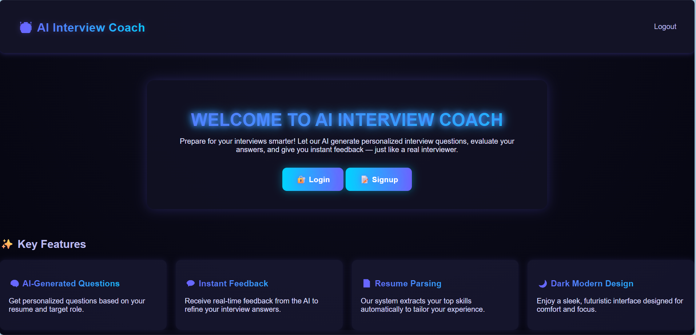
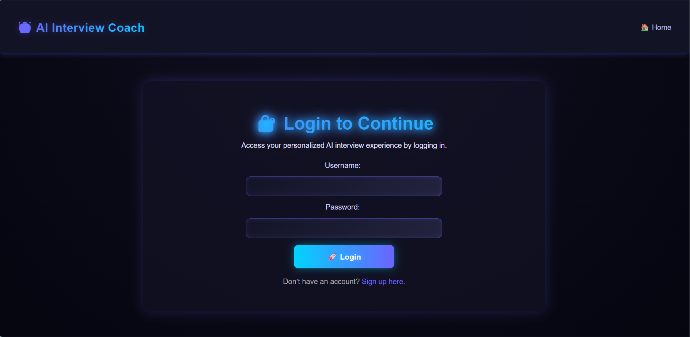
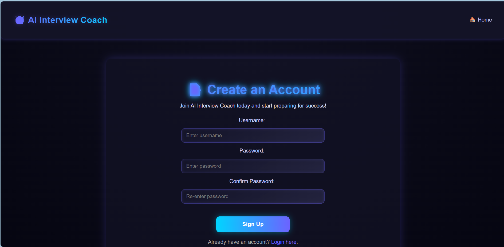
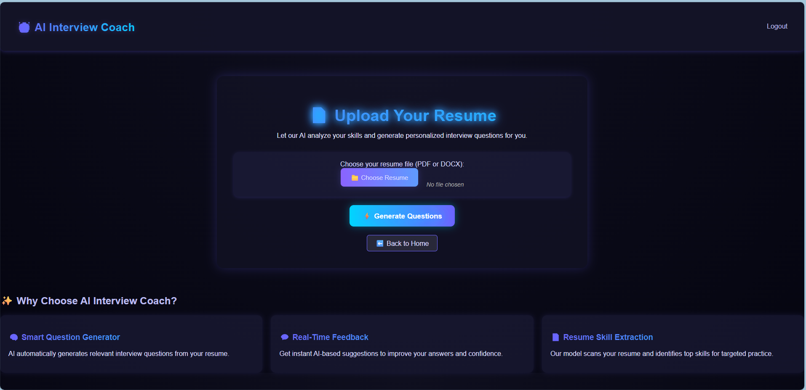
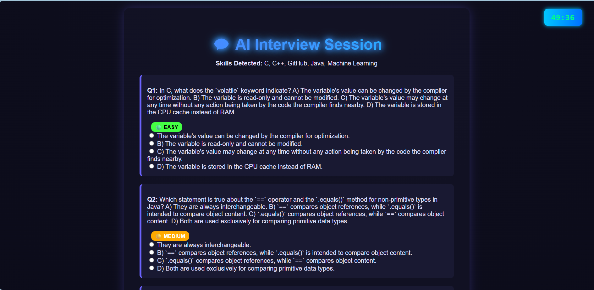
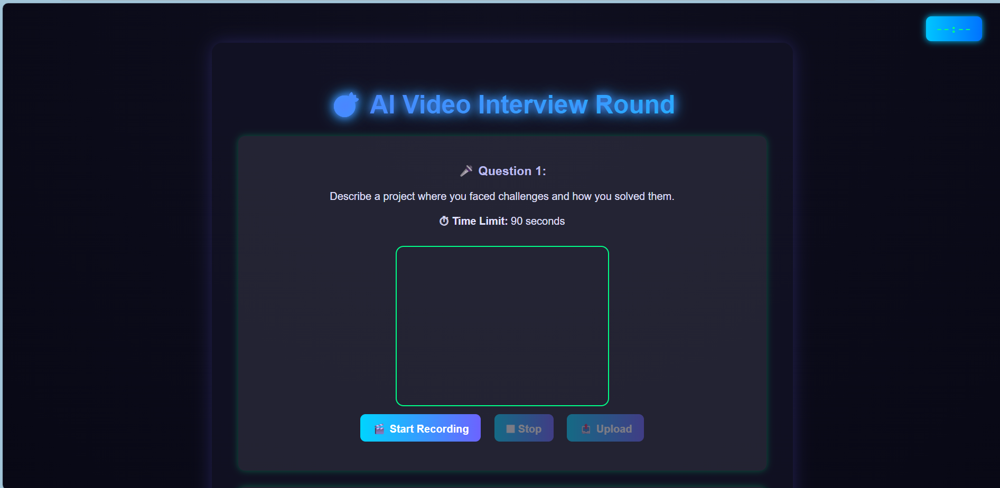
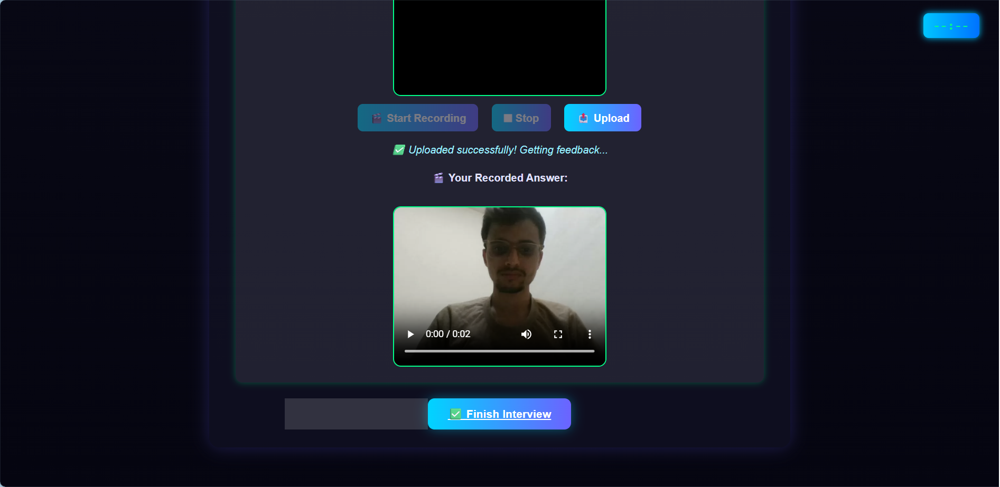
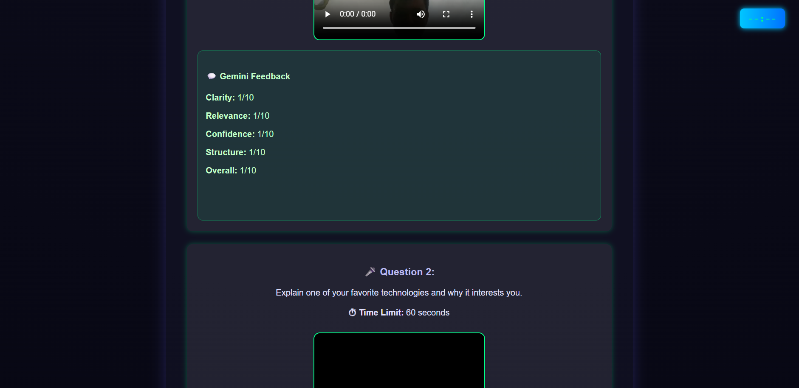
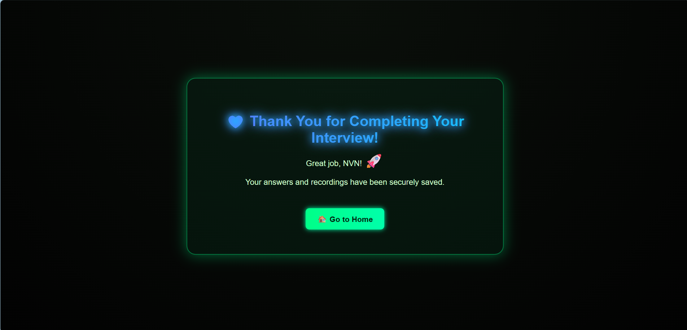

# 🤖 AI Interview Coach  

**AI Interview Coach** is an intelligent Flask-based web application that helps users prepare for interviews using **Artificial Intelligence**.  
It analyzes resumes, generates personalized interview questions, and provides instant AI feedback — just like a real interview coach!  

---

## 🌐 Live Demo
🔗 https://ai-interview-coach-wxs5.onrender.com 

---

## 🚀 Features  

- 🧠 **AI-Generated Interview Questions** — Generated dynamically based on your uploaded resume or selected job role.  
- 📄 **Smart Resume Parser** — Automatically extracts key skills and experiences from uploaded resumes.  
- 💬 **Real-Time AI Feedback** — Evaluates spoken or written responses for clarity, confidence, and structure.  
- ⏱️ **50-Minute Interview Timer** — Simulates a realistic interview environment.  
- 🔐 **Secure Authentication** — Login/Signup system with strong password validation.  
- 🎨 **Glassmorphism UI** — Beautiful, glowing design with gradient buttons and smooth animations.  
- ⚡ **Powered by Google Gemini 2.5 Flash API** — Generates intelligent, dynamic interview questions.  
- 🔑 **Environment Security** — API keys are safely managed using `.env` files and never exposed in the repository.  

---

## 🧩 Tech Stack

- **Frontend:** HTML5, CSS3, JavaScript (Glassmorphism UI)
- **Backend:** Python (Flask Framework)
- **AI Engine:** Google Gemini 2.5 Pro & Flash APIs
- **Resume Parsing:** PyPDF2, python-docx, regex
- **Video Handling:** OpenCV, WebM recording
- **Environment Management:** python-dotenv
- **Version Control:** Git & GitHub

---

## 🔑 Gemini API Setup

To enable AI-generated questions, this project integrates **Google Gemini 2.5 Flash API**.

1. Go to [Google AI Studio](https://aistudio.google.com/).  
2. Create a new API key under your Google Cloud project.  
3. Create a `.env` file in your main folder and add:
4. The key is securely loaded using python-dotenv in the app.

⚠️ Note: The .env file is ignored via .gitignore and never pushed to GitHub, ensuring API key security.

---

   ```bash
   GEMINI_API_KEY=your_api_key_here
```
## 🗂️ Project Structure
ai_interview_coach/
├── app.py — Main Flask application
├── resume_parser.py — Extracts skills from uploaded resumes
├── question_gen.py — Generates AI-based interview questions
├── feedback_engine.py — Provides AI-based written and spoken feedback
├── requirements.txt — Python dependencies list

│
├── static/ — CSS, JS, and other static assets
│ └── style.css — Main stylesheet for UI design

│
├── templates/ — HTML templates for different app pages
│ ├── home.html — Homepage
│ ├── login.html — User login page
│ ├── signup.html — Account signup with password validation
│ ├── upload.html — Resume upload & question generation
│ ├── interview.html — Interactive AI interview interface
│ ├── video_round.html — Video interview question round
│ └── thankyou.html — Final completion screen

│
└── screenshots/ — UI demonstration images
  ├── home_page.png
  ├── login_page.png
  ├── signup_page.png
  ├── upload_resume_page.png
  ├── written_interview_questions.png
  ├── video_round_start.png
  ├── video_upload_success.png
  ├── video_feedback_section.png
  └── thankyou_page.png

```
---
```
## ⚙️ How to Run Locally

### 1️⃣ Clone the repository
```bash
git clone https://github.com/navneetchinchole04/ai_interview_coach.git
cd ai_interview_coach
```

### 2️⃣ Install dependencies
pip install -r requirements.txt

### 3️⃣ Run the Flask app
python app.py

### 4️⃣ Open in browser
👉 http://127.0.0.1:5000/

---

## 🧾 Example User Flow  

1️⃣ **Sign Up:** Create an account securely with password validation  
 (min 7 characters, at least 1 uppercase, 1 lowercase, and 1 digit).  

2️⃣ **Upload Resume:** The system automatically extracts your top technical skills.  

3️⃣ **AI Interview Round:** Get MCQs, coding, pseudocode, and conceptual questions generated by Gemini AI.  

4️⃣ **Video Response Round:** Record your spoken answers via webcam for real-time evaluation.  

5️⃣ **AI Evaluation:** Receive instant scores and detailed feedback (Clarity, Relevance, Confidence, Structure, Overall).  

6️⃣ **Completion Page:** End with a smooth animated “Thank You” screen and improvement tips.  

---

## 🖼️ Demo Screenshots  
✨ **Overview**

<p align="center">
  
  
</p>

<p align="center">
  
  
</p>

<p align="center">
  
  
</p>

<p align="center">
  
  
</p>

<p align="center">
  
</p>

---
## 🧠 Description of Each Page  

| Page | Description |
|------|--------------|
| 🏠 **Home Page** | Entry point introducing AI Interview Coach with app overview and navigation buttons. |
| 🔑 **Login Page** | Secure login with validation for existing users. |
| 🆕 **Signup Page** | Create account with strong password validation (uppercase, lowercase, number). |
| 📄 **Upload Page** | Upload your resume — the system automatically extracts your key skills. |
| 🤖 **Interview Page** | AI-powered Q&A session with real-time feedback and Gemini evaluation. |
| 💬 **Feedback Page** | Displays AI-generated feedback with clarity, relevance, and improvement tips. |
| 🎉 **Thank You Page** | Smooth completion screen after the interview session ends. |

---

🚀 Future Improvements

🗄️ Add database support (SQLite/Firebase) for persistent user data

🤖 Integrate an advanced AI model (e.g., GPT or LLaMA) for dynamic questions

🧩 Add analytics dashboard for interview performance tracking

🌐 Deploy on Render / Vercel / Hugging Face Spaces

---

## 🌐 Deployment

To deploy your Flask app online:

1. Create a free account on [Render](https://render.com/) or [Vercel](https://vercel.com/).
2. Connect your GitHub repository.
3. Set the build command as:
   ```bash
   pip install -r requirements.txt
4. Set the start command as:
   ```bash
   gunicorn app:app

---

## 💡 Author

**👨‍💻 Navneet Chinchole**  
🎓 B.Tech in Electronics & Computer Engineering  
📧 [navneetchinchole04@gmail.com](mailto:navneetchinchole04@gmail.com)  
🔗 [GitHub Profile](https://github.com/navneetchinchole04)

---

⭐ If you found this project useful, please give it a star on GitHub! 🌟
